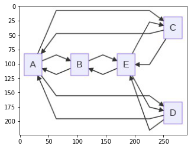

> **Warning**
>
> ## THIS IS AN AUTOGENERATED FILE. DO NOT EDIT.
>
> ## Please edit the corresponding file in [/packages/mermaid/src/docs/config/Tutorials.md](../../packages/mermaid/src/docs/config/Tutorials.md).

# Tutorials

This is a list of publicly available Tutorials for using Mermaid.JS and is intended as a basic introduction for the use of the Live Editor for generating diagrams, and deploying Mermaid.JS through HTML.

**Note that these tutorials might display an older interface, but the usage of the live-editor will largely be the same.**

For most purposes, you can use the [Live Editor](https://mermaid.live), to quickly and easily render a diagram.

## Live-Editor Tutorials

The definitions that can be generated the Live-Editor are also backwards-compatible as of version 8.7.0.

[Chris Chinchilla: Hands on - Text-based diagrams with Mermaid](https://www.youtube.com/watch?v=4_LdV1cs2sA)

[GitLab Unfiltered: How to Create Mermaid Diagrams](https://www.youtube.com/watch?v=SQ9QmuTHuSI&t=438s)

[GitLab Unfiltered: Emilie adds a mermaid diagram to the handbook](https://www.youtube.com/watch?v=5RQqht3NNSE)

[World of Zero: I Learn How To Build Flowcharts and Signal Diagram's in Mermaid.JS](https://www.youtube.com/watch?v=7_2IroEs6Is&t=207s)

[Eddie Jaoude: Can you code your diagrams?](https://www.youtube.com/watch?v=9HZzKkAqrX8)

## Mermaid with OpenAI

[Elle Neal: Mind Mapping with AI: An Accessible Approach for Neurodiverse Learners Tutorial:](https://medium.com/@elle.neal_71064/mind-mapping-with-ai-an-accessible-approach-for-neurodiverse-learners-1a74767359ff), [Demo:](https://databutton.com/v/jk9vrghc)

## Mermaid with HTML

Examples are provided in [Getting Started](../intro/getting-started.md)

**CodePen Examples:**

<https://codepen.io/CarlBoneri/pen/BQwZzq>

<https://codepen.io/tdkn/pen/vZxQzd>

<https://codepen.io/janzeteachesit/pen/OWWZKN>

## Mermaid with Text Area

<https://codepen.io/Ryuno-Ki/pen/LNxwgR>

## Mermaid in open source docs

[K8s.io Diagram Guide](https://kubernetes.io/docs/contribute/style/diagram-guide/)

[K8s.dev blog: Improve your documentation with Mermaid.js diagrams](https://www.kubernetes.dev/blog/2021/12/01/improve-your-documentation-with-mermaid.js-diagrams/)

## Jupyter Integration with mermaid-js

Here's an example of Python integration with mermaid-js which uses the mermaid.ink service, that displays the graph in a Jupyter notebook.

```python
import base64
from IPython.display import Image, display
import matplotlib.pyplot as plt

def mm(graph):
    graphbytes = graph.encode("utf8")
    base64_bytes = base64.b64encode(graphbytes)
    base64_string = base64_bytes.decode("ascii")
    display(Image(url="https://mermaid.ink/img/" + base64_string))

mm("""
graph LR;
    A--> B & C & D;
    B--> A & E;
    C--> A & E;
    D--> A & E;
    E--> B & C & D;
""")
```

**Output**


